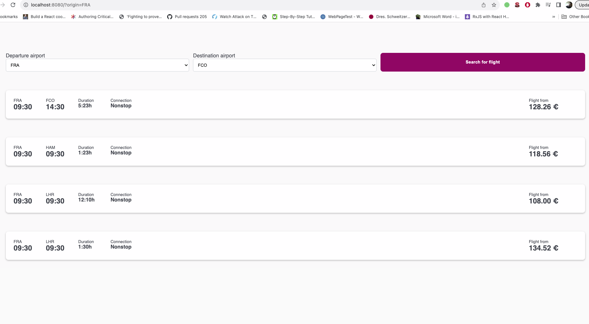

# EuroWings Challenge



# Table of Contents

- [Getting Started](#getting-started)
- [Technology Stack](#technology-stack)
- [Installation](#installation)
- [Usage](#usage)
- [Testing](#testing)
- [API Endpoints](#api-endpoints)
- [Questions](#questions)
- [Support or Contribution](#support-or-contribution)

## Getting Started

This is a javascript application built with [**Node JS**](https://nodejs.org/en/) using [**Express**](https://expressjs.com/) framework on the backend and React JS on the frontend.

## Technology Stack

**Server Side**

1. NodeJS
2. Express FrameWork

**Client Side**

1. Vue JS
2. WebPack

## Installation

1. Install [**Node JS**](https://nodejs.org/en/).

2. Clone the [**repository here**](https://github.com/benfluleck/Euro-Wings)
3. [**cd**] into the root of the **project directory**.
4. Run `pnpm install` on the terminal to install project dependecies
5. Create a `.env` file in the root directory of the application. Example of the content of a .env file is shown in the .env.sample
6. Start the application:
   **_Different Build Environments_**

**Production**

```
pnpm start:fend-build
pnpm build:server-prod
pnpm start:server-prod
```

**Development**

```
pnpm start:fend-dev
pnpm server:dev
```

## Testing

Client side tests - Run `pnpm run test` on the terminal while within the **project root directory**.

Client side testing is achieved through the use of `vitest`, `vue/test-utils` packages

## API Endpoints

Api endpoints were created using `express` router.

| Request type | Endpoint            | Action                               |
| ------------ | ------------------- | ------------------------------------ |
| GET          | /api/v1/priceoffers | Gets all flights from the custom API |

## Questions

For more details contact benfluleck@gmail.com
